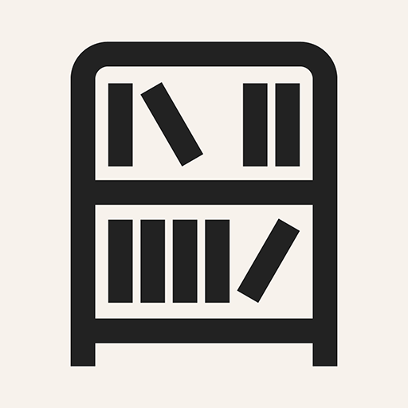

<div class="title-block" style="text-align: center;" align="center">

# Bunko Shelf

<p></p>

</div>

## Introducción

**Bunko Shelf** es un servidor gratuito y auto-hospedado para organización y lectura de manga y libros digitales. Está completamente desarrollado con Next.js 15, SQLite y Prisma.

## Docker Compose

```yaml
services:
  bunkoshelf:
    image: itsmrtr/bunkoshelf:latest
    container_name: bunkoshelf
    restart: unless-stopped
    ports:
      - "3000:3000"
    volumes:
      - bunko_db:/app/prisma/data
      - /path/to/your/library/manga:/library/manga
      - ./public/covers:/app/public/covers

volumes:
  bunko_db:
```

## Docker CLI

```bash
docker run -d \
  --name bunkoshelf \
  --restart unless-stopped \
  -p 3000:3000 \
  -v bunko_db:/app/prisma/data \
  -v /path/to/your/library/manga:/library/manga \
  -v $(pwd)/public/covers:/app/public/covers \
  itsmrtr/bunkoshelf:latest
```

<br>

Licencia y documentación: [Bunko Shelf](https://bunko.amlab.site).
